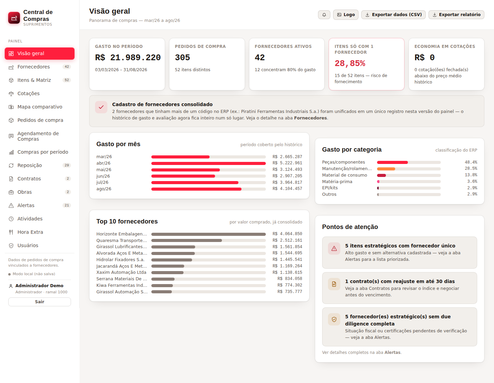
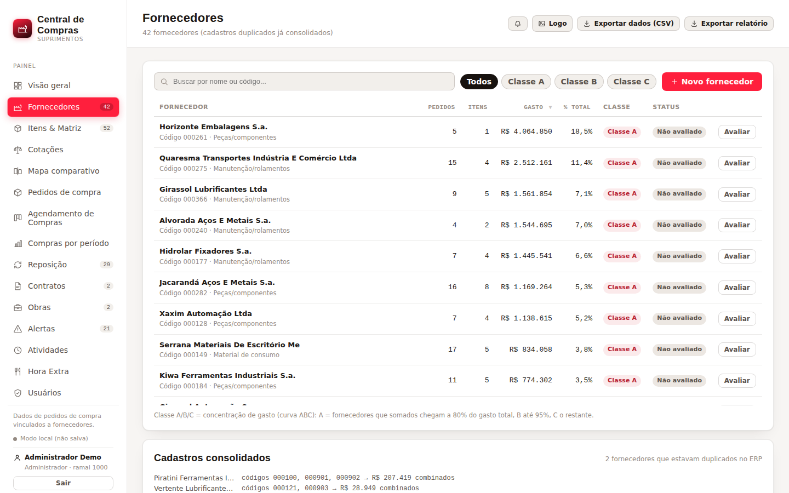
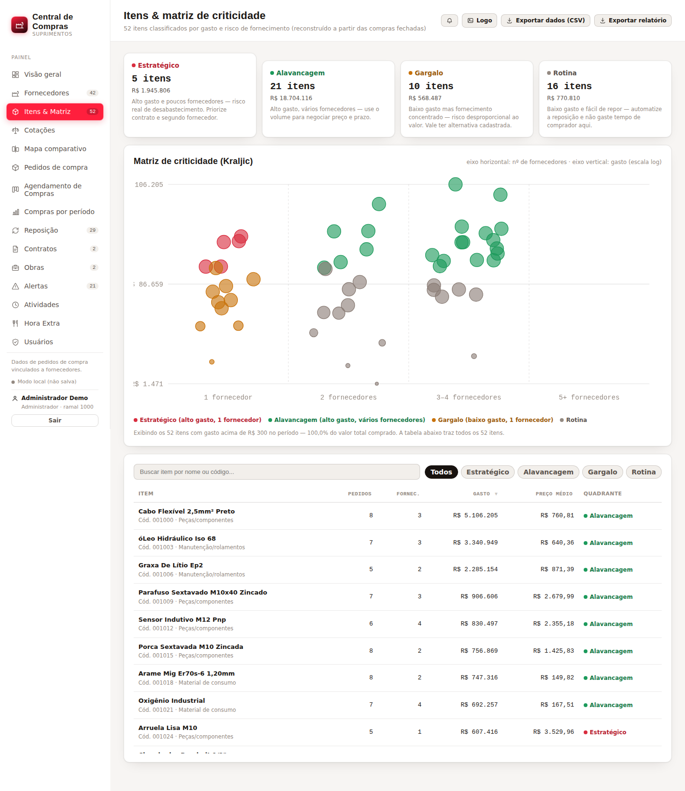
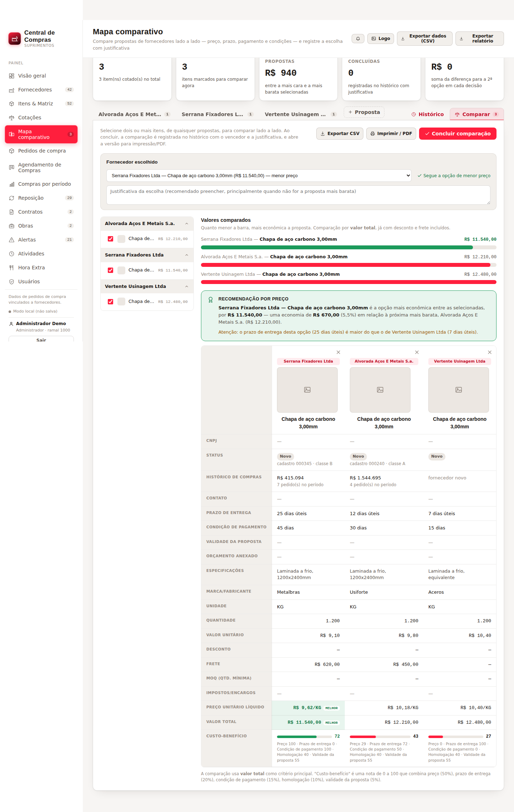
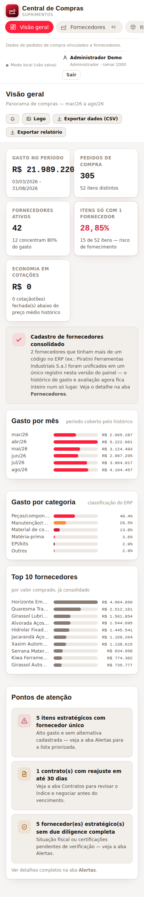

# Central de Compras (Procurement Hub)

A supply-chain management dashboard that runs entirely inside **a single HTML file** — no
server, no database, no install, no external dependency. Double-click to open, works
offline, fits on a USB stick.

Built for the day-to-day of an industrial purchasing department: consolidate ERP spend,
classify suppliers and items by risk, log quotations requiring at least three bids, compare
proposals side by side, and track purchase orders through to delivery.

The interface is in Brazilian Portuguese, as it was written for a Brazilian factory floor.

*[Versão em português](README.md)*



> Every figure in the screenshots and in this repository is **fictional**, produced by
> `tools/gerar_dados_exemplo.py`. No real supplier, price or purchase order from any company
> is included.

---

## Contents

- [Running it](#running-it)
- [What it does](#what-it-does)
- [Using your own data](#using-your-own-data)
- [How it works inside](#how-it-works-inside)
- [Tests](#tests)
- [Limits and security](#limits-and-security)
- [License](#license)

---

## Running it

You only need Python 3.8+ to assemble the file. The app itself needs nothing.

```bash
git clone https://github.com/<your-user>/central-de-compras.git
cd central-de-compras

python3 tools/gerar_dados_exemplo.py   # build the fictional dataset
python3 build.py                       # assemble dist/central-de-compras.html
```

Open `dist/central-de-compras.html` in a browser. On first run it asks you to register: use
the factory admin code **`ADMIN-SETUP-2026`** so the first account becomes an administrator —
then **change that code** right away under the *Usuários* tab, since it is public here.

---

## What it does

### Overview (Visão geral)
Period indicators (spend, orders, active suppliers, concentration), spend per month and per
category, the ten largest suppliers, and the points that need a buyer's attention.

### Suppliers (Fornecedores)
A consolidated register — suppliers that carried several codes in the ERP show up as one
record with the whole history together. Each has a full profile: legal name, tax ID, payment
terms, contact, address, star rating, approval status and certificate attachments. Suppliers
that do not exist in the ERP yet can be added by hand.



### Items & Matrix (Itens & Matriz)
Every purchased item, classified on the **Kraljic matrix** into strategic, leverage,
bottleneck and routine, crossing spend against supplier count. The scatter plot makes it
immediately clear which items concentrate both money and risk.



### Quotations (Cotações)
Quotation logging that requires at least three bids per item, each with supplier, price and
a **photo of the item**. An administrator picks the winner; closing with fewer bids than
policy requires forces a written justification, which is kept on record.

### Comparison map (Mapa comparativo)
Side-by-side proposal comparison. Each proposal received becomes a tab holding the supplier
profile and the quoted items (photo, brand, spec, quantity, price, discount, freight, MOQ,
taxes). The comparison view adds:

- **net unit price** — total including discount and freight, divided by quantity, the only
  honest way to compare proposals quoting different quantities;
- a **price recommendation** with the caveats that matter: longer lead time, better payment
  terms elsewhere, expired proposal, non-approved supplier;
- a **0–100 value-for-money score** with weights stated on screen (price 50%, lead time 20%,
  payment terms 15%, approval 10%, proposal validity 5%), shown as a second opinion whenever
  it points to a supplier other than the cheapest;
- the decision recorded with a justification, stored in history alongside a snapshot of every
  option considered at the time;
- CSV export and a print/PDF sheet.



### Purchase orders (Pedidos de compra)
Issued automatically when a quotation is approved. Goods receipt logging with date, quantity,
invoice number, attachment and a quality-problem flag — which feeds back into the supplier
performance indicator.

### Purchase scheduling (Agendamento de Compras)
A Kanban board (pending → buying → bought) for the administrator to assign purchases to a
specific operator and follow progress.

### Period analysis, Replenishment, Contracts, Projects
Closed purchases grouped by week and month; reorder-point suggestions from consumption
history; contracts with index-based escalation (IPCA, IGP-M, INCC) and renewal alerts; and
linking of quotations and contracts to projects / cost centres.

### Alerts (Alertas)
Strategic items with a single supplier, abnormal price variation, contracts near escalation,
quotations awaiting a decision, and suppliers with incomplete due diligence.

### Users and access
Three roles — administrator, operator and department head — with registration subject to
approval. A department head only sees the overtime-meals tab.

### On a phone
Below 900px wide the sidebar stops being a fixed column and becomes a scrollable strip of
tabs at the top, freeing the full screen width for content. Checking alerts or looking up a
price from the shop floor works without pinch-zooming.




---

## Using your own data

The dataset is a single JSON file. The simplest way to start clean is to copy
`data/dados_exemplo.json`, empty the lists and rebuild:

```bash
python3 build.py data/my_data.json dist/my-panel.html
```

The format is documented in [`docs/FORMATO-DE-DADOS.md`](docs/FORMATO-DE-DADOS.md). In
practice the source is usually a purchase-order report exported from an ERP, aggregated by
supplier and by item — that is how the original dataset was produced.

Once in use, **the panel stores its own data inside the HTML file**: every change rewrites
the whole document, code and data together. There is no database, no API and no sync — it is
a file that knows how to rewrite itself.

---

## How it works inside

Three source files, stitched into one at build time:

```
src/template.html   HTML shell + all the CSS (design tokens, light theme, neon red accent)
src/app.js          the whole application: state, business rules and rendering
data/*.json         the data
        ↓  build.py
dist/central-de-compras.html    one file, ~500 KB, self-contained
```

**Plain JavaScript**, no framework, no transpile step, no `node_modules`. The pattern is
small enough to hold in your head:

- `STATE` holds everything persisted; `UI` holds screen-only state (active tab, filters, open
  forms).
- `render()` rebuilds the whole of `#app.innerHTML` from `STATE` + `UI`.
- Events are handled by **delegation on `document`** — one `click`, one `input`, one `change`
  and one `keydown` listener for the entire app. No listener is bound to an element, so a
  full re-render can never leave an orphan handler behind.
- `persist()` rewrites the document with the new data.

That keeps the code readable top to bottom, at the cost of re-rendering everything on each
action — imperceptible at the data volume of a purchasing department. Where re-rendering
would hurt (the editable table in the comparison map, where losing focus on every field would
get in the way of typing), changes are committed to state and only the derived figures are
rewritten on screen.

A line-by-line navigation map lives in [`docs/ARQUITETURA.md`](docs/ARQUITETURA.md)
(Portuguese).

---

## Tests

The suite uses [Playwright](https://playwright.dev/python/) and drives the panel in a real
Chromium, clicking through the interface the way a user would.

```bash
pip install playwright
playwright install chromium

python3 tests/run_all.py              # build everything and run all 12 files
python3 tests/run_all.py comparativo  # only those matching the name
```

The runner generates the datasets, assembles the HTML and runs the tests — nothing to set up
beforehand. Roughly 250 assertions cover the end-to-end quotation flow, the comparison map,
exception approvals, price arithmetic (including a regression test for a bug that multiplied
values by 100), CSV export, dark mode, document self-rewrite, and a sweep across every tab
looking for `undefined`/`NaN` leaking into the UI.

---

## Limits and security

Worth being direct about the model, because it is an unusual one:

- **The data lives in the file.** Whoever has the file has the data. There is no encryption.
  Treat the generated HTML the way you would treat the company's purchasing spreadsheet.
- **The login protects the interface, not the file.** Passwords are stored as SHA-256 with a
  per-user salt, which keeps them out of plain text, but verification happens in the browser.
  Anyone opening the file in a text editor can read the data.
- **Change the factory admin code** (`ADMIN-SETUP-2026`) as soon as the first account exists.
  It is public in this repository.
- **It is not concurrent multi-user.** Two people editing different copies at the same time
  will diverge.

For a purchasing department currently working out of scattered spreadsheets, this is usually
a large step up at zero operating cost. For anything demanding formal audit trails, real
access control or heavy simultaneous use, a different architecture is the answer.

---

## License

[MIT](LICENSE) — Copyright (c) 2026 Henrique Paulo Fernandez.

You may use, copy, modify and distribute it, including commercially, as long as the copyright
notice is kept.
